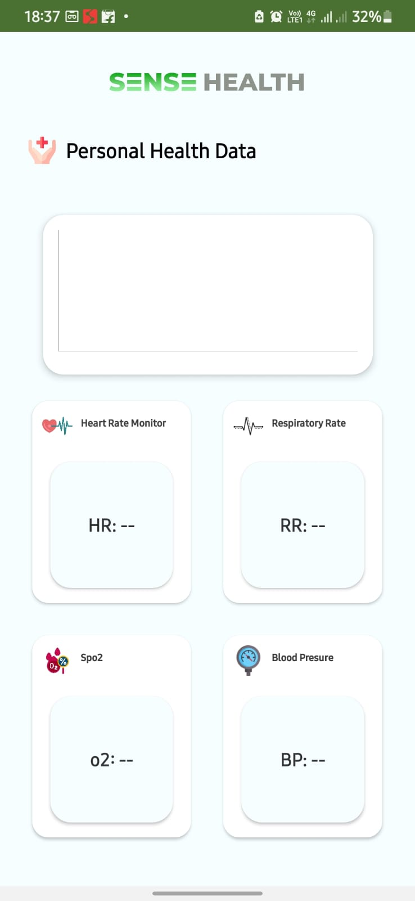

# Bluetooth Socket & BLE Android Project


## Table of Contents
- [Overview](#overview)
- [Features](#features)
- [Architecture](#architecture)
- [Setup Instructions](#setup-instructions)
- [Screenshots](#screenshots)

## Overview
This Android project implements Bluetooth Classic Socket and BLE (Bluetooth Low Energy) functionalities, allowing for seamless wireless communication between devices. It is designed to facilitate easy connectivity and data transfer, making it suitable for IoT applications and smart devices.

## Features
- **Bluetooth Classic Socket**: Establishes a reliable connection using the RFCOMM protocol for traditional Bluetooth devices.
- **BLE Support**: Communicates with BLE devices using Service and Characteristic UUIDs, allowing for efficient low-energy operations.
- **Data Transfer**: Supports bi-directional data transmission over Bluetooth, enabling real-time communication between devices.
- **Live Graph Updates**: Visualizes incoming data in real-time using custom graphs, enhancing user experience.


## Setup Instructions
1. Clone the repository:
   ```bash
   git clone https://github.com/username/project-name.git

## Screenshots

